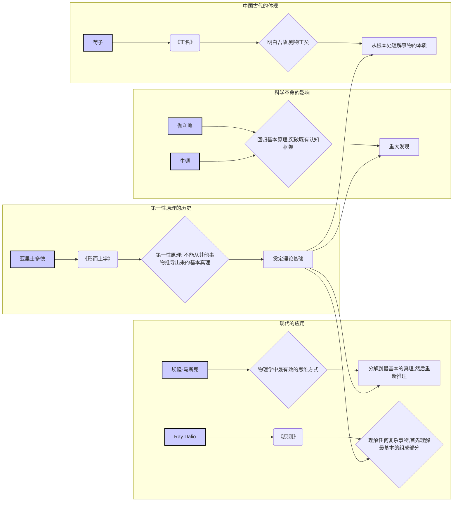

```mermaid
graph LR
    subgraph 第一性原理的历史
        A[亚里士多德] --> B(《形而上学》);
        B --> C{第一性原理: 不能从其他事物推导出来的基本真理};
        C --> D[奠定理论基础];
    end
    
    subgraph 现代的应用
        E[埃隆·马斯克] --> F{物理学中最有效的思维方式};
        F --> G[分解到最基本的真理,然后重新推理];
    
        H[Ray Dalio] --> I(《原则》);
        I --> J{理解任何复杂事物,首先理解最基本的组成部分};
    end

    subgraph 中国古代的体现
        K[荀子] --> L(《正名》);
        L --> M{明白吾故,则物正矣};
        M --> N[从根本处理解事物的本质];
    end


    subgraph 科学革命的影响
        O[伽利略] & P[牛顿] --> Q{回归基本原理,突破既有认知框架};
        Q --> R[重大发现];
    end

    D --> G;
    D --> J;
    D --> N;
    D --> R;
    
    style A fill:#ccf,stroke:#000,stroke-width:2px;
    style E fill:#ccf,stroke:#000,stroke-width:2px;
    style H fill:#ccf,stroke:#000,stroke-width:2px;
    style K fill:#ccf,stroke:#000,stroke-width:2px;
    style O fill:#ccf,stroke:#000,stroke-width:2px;
    style P fill:#ccf,stroke:#000,stroke-width:2px;
```