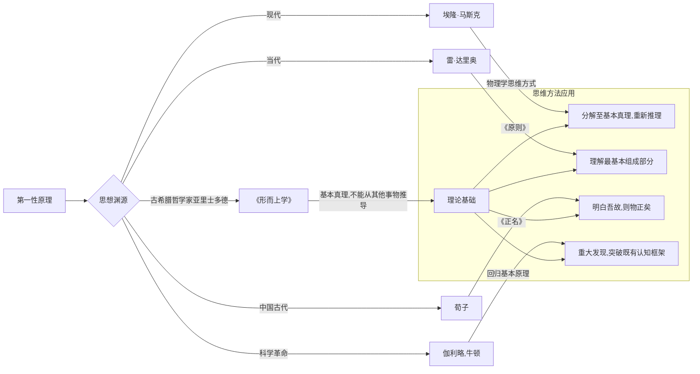

```mermaid
graph LR
    A[第一性原理] --> B{思想渊源};
    B -- 古希腊哲学家亚里士多德 --> C["《形而上学》"];
    C -- 基本真理,不能从其他事物推导 --> D[理论基础];
    B -- 现代 --> E[埃隆·马斯克];
    E -- 物理学思维方式 --> F[分解至基本真理,重新推理];
    B -- 当代 --> G[雷·达里奥];
    G -- 《原则》 --> H[理解最基本组成部分];
    B -- 中国古代 --> I[荀子];
    I -- 《正名》 --> J[明白吾故,则物正矣];
    B -- 科学革命 --> K[伽利略,牛顿];
    K -- 回归基本原理 --> L[重大发现,突破既有认知框架];
    
    subgraph "思维方法应用"
        D --> F
        D --> H
        D --> J
        D --> L
    end
```