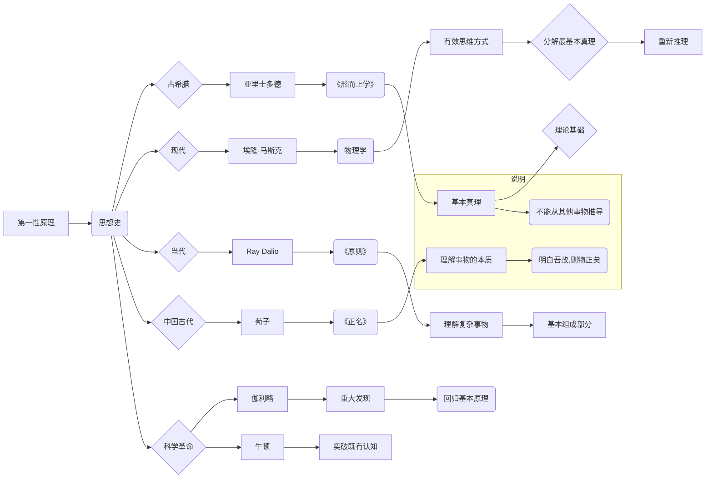

```mermaid
graph LR
    A[第一性原理] --> B(思想史);
    B --> C{古希腊};
    C --> D[亚里士多德];
    D --> E(《形而上学》);
    E --> F[基本真理];
    F --> G{理论基础};
    
    B --> H{现代};
    H --> I[埃隆·马斯克];
    I --> J(物理学);
    J --> K[有效思维方式];
    K --> L{分解最基本真理};
    L --> M[重新推理];
    
    B --> N{当代};
    N --> O[Ray Dalio];
    O --> P(《原则》);
    P --> Q[理解复杂事物];
    Q --> R[基本组成部分];
    
    B --> S{中国古代};
    S --> T[荀子];
    T --> U(《正名》);
    U --> V[理解事物的本质];
    
    B --> W{科学革命};
    W --> X[伽利略];
    W --> Y[牛顿];
    X --> Z[重大发现];
    Y --> AA[突破既有认知];
    Z --> BB(回归基本原理);
    
    subgraph 说明
        F --> F1(不能从其他事物推导);
        V --> V1(明白吾故,则物正矣);
        
    end
```