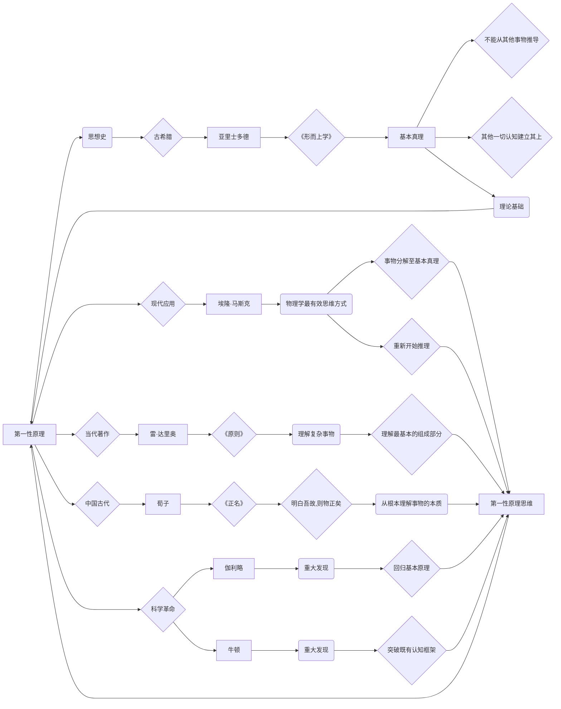

```mermaid
graph LR
    A[第一性原理] --> B(思想史);
    B --> C{古希腊};
    C --> D[亚里士多德];
    D --> E{《形而上学》};
    E --> F[基本真理];
    F --> G{不能从其他事物推导};
    F --> H{其他一切认知建立其上};
    F --> I(理论基础);
    I --> A;

    A --> J{现代应用};
    J --> K[埃隆·马斯克];
    K --> L(物理学最有效思维方式);
    L --> M{事物分解至基本真理};
    L --> N{重新开始推理};
    M --> O[第一性原理思维];
    N --> O;
    O --> A;


    A --> P{当代著作};
    P --> Q[雷·达里奥];
    Q --> R{《原则》};
    R --> S(理解复杂事物);
    S --> T{理解最基本的组成部分};
    T --> O;


    A --> U{中国古代};
    U --> V[荀子];
    V --> W{《正名》};
    W --> X{明白吾故,则物正矣};
    X --> Y(从根本理解事物的本质);
    Y --> O;


    A --> Z{科学革命};
    Z --> AA[伽利略];
    Z --> AB[牛顿];
    AA --> AC(重大发现);
    AB --> AD(重大发现);
    AC --> AE{回归基本原理};
    AD --> AF{突破既有认知框架};
    AE --> O;
    AF --> O;
```